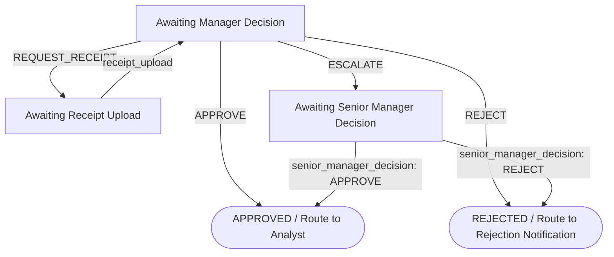

# Human-in-the-Loop (HITL) Design Report

This report summarizes the design, stateless implementation, validation bypasses, and endpoints for the **Human-in-the-Loop (HITL)** approval workflow in **FinOps Guardian**.

---

## 1. Stateless State Machine Node (`workflows/approval_node.py`)

To ensure robust execution across session pauses, we implemented a stateless approval node in `workflows/approval_node.py`. The current phase is reconstructed by checking the presence and values of active inputs in `ctx.resume_inputs` rather than modifying session state mid-pause:



- **Approve / Reject**: Directly maps the claim to success (ERP commit) or rejection.
- **Request Receipt**: Pauses execution to request user receipt attachment, and loops back to final manager review upon upload.
- **Escalate**: Elevates high-risk audits to the Senior Manager decision interface.

---

## 2. Validation Bypass Interceptor

- **Constraint**: Strict Pydantic model validation on `ExpenseReport` rejects missing receipts on amounts > $25.00, which would normally abort the run before reaching human approval.
- **Solution**: The `run_validation` node catches this specific Pydantic `ValidationError` and bypasses strict rejection, forwarding it as a `VALID` event to the Auditor. This enables the Auditor to flag it as a `MEDIUM-RISK` policy violation and route it to the manager approval queue (so the manager can request the missing receipt).

---

## 3. Manager Decision REST Endpoint (`app/fast_api_app.py`)

We exposed a REST route on the server wrapper to resume paused sessions:

- **Endpoint**: `POST /sessions/{session_id}/decide`
- **Payload**:
  ```json
  {
    "user_id": "test_user",
    "decision": "APPROVE",
    "notes": "Flight details verified. Approved.",
    "interrupt_id": "manager_decision"
  }
  ```
- **Execution**: Matches the manager response to the active interrupt and asynchronously drives the agent to the next step.

---

## 4. Test Verification Suite

The test cases in `tests/unit/test_root_agent.py` verify all paths utilizing async list comprehensions:
- Direct approvals and rejections.
- Multi-step Senior Manager escalations.
- Loop-backs for receipt requests and user uploads.
