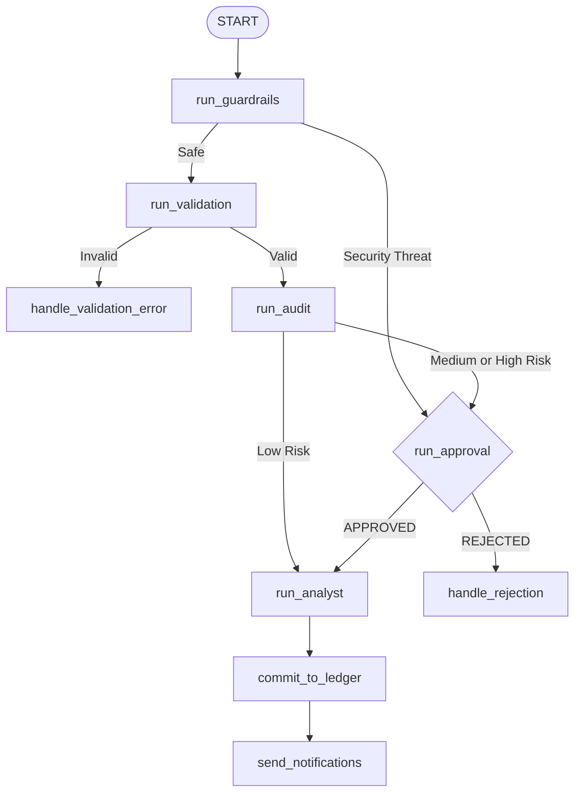

# Root Compliance Agent Design Report

This report summarizes the design, state definition, and routing flow of the **Root Compliance Agent** in the **FinOps Guardian** workspace.

---

## 1. Responsibilities & Architecture

The Root Compliance Agent acts as the central coordinator and orchestrator for all expense claims. It manages state transitions, runs guardrails, handles schema validations, invokes specialized agents, and routes control flow.

---

## 2. State Management (`FinOpsState`)

We define the workflow state variables in Pydantic to track parameters throughout execution:

| State Field | Type | Description |
|---|---|---|
| `raw_input` | `str` | Raw user input submitted to the agent |
| `title` / `sanitized_title` | `str` | Original and PII-redacted expense title |
| `amount` | `float` | Value of the transaction in USD |
| `category` | `str` | Category of the expense (meals, travel, office, software) |
| `expense_date` | `str` | Transaction date |
| `has_receipt` | `bool` | True if a receipt has been uploaded |
| `has_itinerary` | `bool` | True if a travel itinerary is attached |
| `risk_level` | `str` | Compliance risk rating: LOW, MEDIUM, or HIGH |
| `validation_error` | `str` | Schema validation errors |
| `security_threat_detected` | `bool` | True if prompt injection was detected |
| `approval_status` | `str` | HITL status (APPROVED, REJECTED, ESCALATED, AWAITING_RECEIPT) |
| `manager_decision` | `str` | Manager choice (APPROVE, REJECT, REQUEST_RECEIPT, ESCALATE) |
| `tax_code` | `str` | Mapped tax category deductibility code |
| `committed_to_erp` | `bool` | True if transaction is written to the ledger |
| `notified` | `bool` | True if success/fail notification is sent |

---

## 3. Workflow Routing Logic

1. **Security Guardrails (`run_guardrails`)**:
   - Detects prompt injection (e.g. override instructions). Routes to `run_approval` if a threat is found.
   - Redacts PII (emails, phone numbers, SSNs, credit cards) and secrets (API keys, passwords).
2. **Schema Validation (`run_validation`)**:
   - Parses the claim into the `ExpenseReport` Pydantic model.
   - If an error is a missing receipt on an amount > $25, the system intercepts the validation error and bypasses it to `run_audit` so a manager can review it or request it. Other errors route to `handle_validation_error` and reject immediately.
3. **Auditing (`run_audit`)**:
   - Evaluates daily meals limits, weekend transactions, missing receipts, software thresholds, and duplicate claims.
   - Assigns a risk level:
     - `LOW` -> Maps directly to `run_analyst`.
     - `MEDIUM` / `HIGH` -> Pauses and routes to `run_approval` for manager input.
4. **Approval Loop (`run_approval`)**:
   - Suspends execution statelessly using ADK's `RequestInput` mechanism.
   - Evaluates manager decisions (`APPROVE`, `REJECT`, `REQUEST_RECEIPT`, `ESCALATE`) and loops through user uploads or senior manager approvals before sending the claim to the analyst.
5. **Analyst & Ledger**:
   - Maps category to GL codes and cost centers.
   - Commits approved expenses to the Postgres ledger and publishes success/failure alerts.
